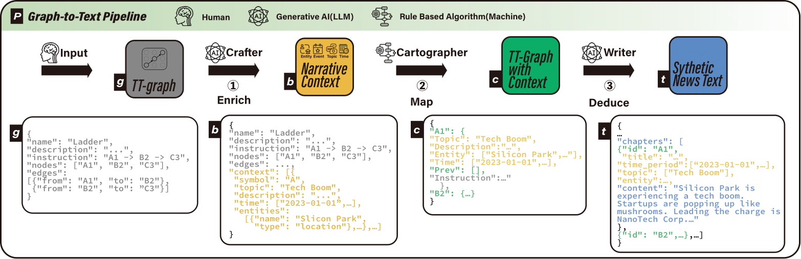

# GPT Storytale

Create controllable story sequences with transformers that can be used in user-evaluation studies of text-to-visualisation pipelines.

&#x1F4D3; Accompanying paper: _<paper title; link to arXiv >_

&#x1F58B; By:



## Getting started

GPT Storytale has been tested on python 3.10. You will need to install the required packages. Using a virtual environment is recommended. e.g.
```bash
python3 -m venv myvenv          # set up the virtual env
source myvenv/bin/activate      # activate the virtual env (Linux) (On Windows: myvenv\Scripts\activate)
pip install -r requirements.txt # install the required packages
```

You will also need to set up your OpenAI API key. You can do this by creating a `.env` file in the root directory of the project and adding the following line:
```bash
OPENAI_API_KEY=your-api-key
```
(see `.env-template` for an example)

## Usage
-- information to run/test the system is working --

## Acknowledgements
-- any packages or tools that were leveraged to make the project possible --

## Cite
-- bibliographic (bibtex) link forthcoming --


